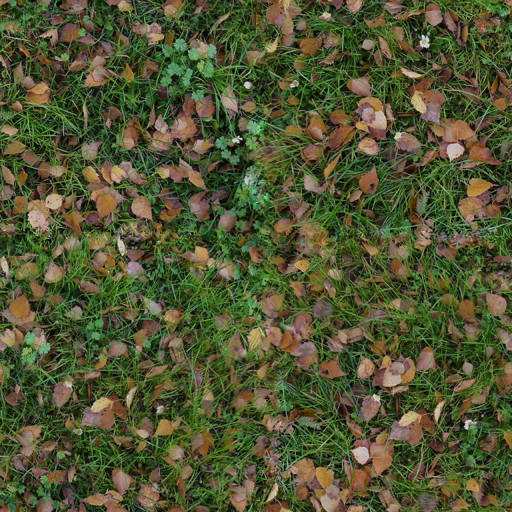
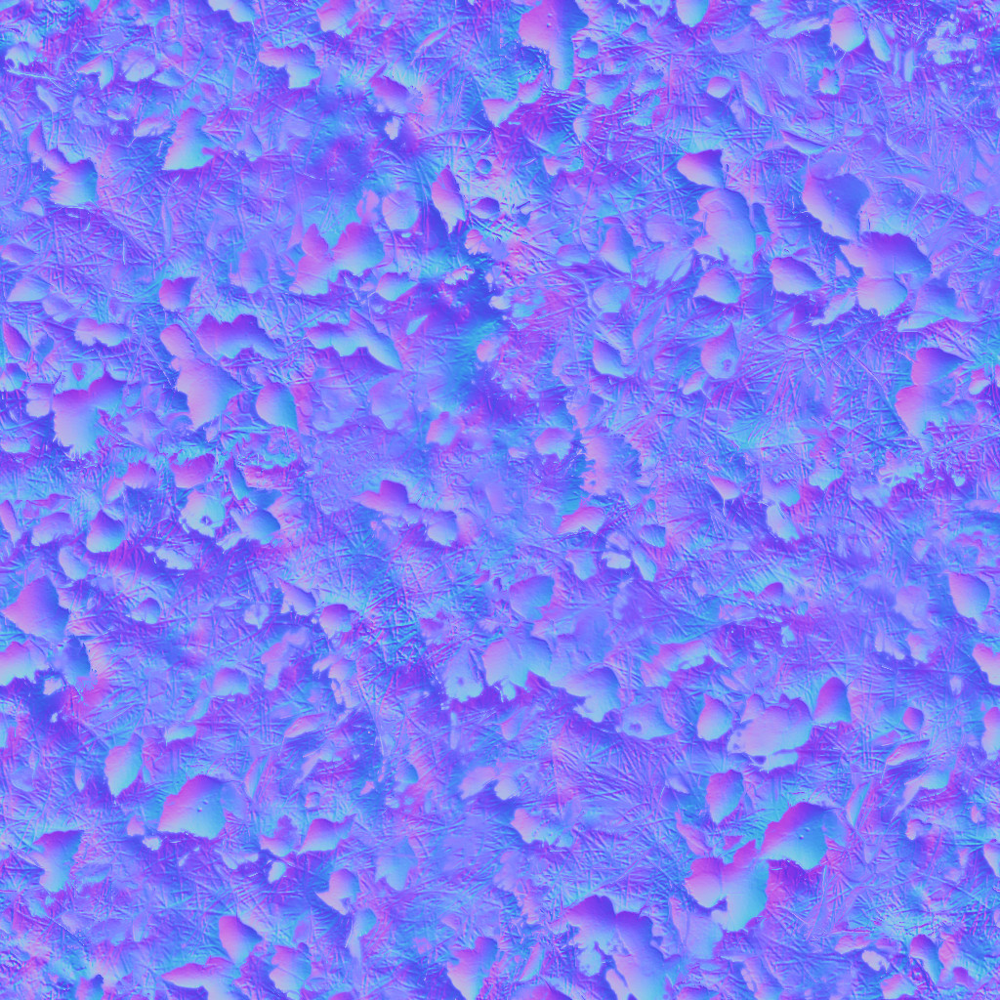

**A-Frame framework**

```html
<script src="https://aframe.io/releases/1.0.4/aframe.min.js"></script>
```


**Scene tag**
```html
    <a-scene stats  renderer="antialias: true;
    colorManagement: true;
    logarithmicDepthBuffer: true;"
    physics="friction: 0.1; restitution: .8">


*Everything from the scene*


      </a-scene>
```


**Add in a box**

```html
<a-box position="-1 0.5 -3" rotation="0 45 0" scale="2 1 2" color="#4CC3D9"></a-box>
```

**Enabling glTF animation component**
```html
   <script src="js/aframe-extras.min.js"></script>
```


**Load assets**
```html
<a-assets>
        <a-asset-item id="blueGorilla" src="./models/blueGorilla.glb"></a-asset-item>
        <a-asset-item id="banana" src="./models/banana.glb"></a-asset-item> 

        <audio id="forestNight" src="audio/ForestNight.mp3" preload="auto"></audio>
        <audio id="explodingSound" src="audio/explosion.wav" preload="auto"></audio>

        
        
        
      </a-assets>
```


**Banana bomb component added to entity**
```html
      <a-entity id="bananaBomb" banana-bomb dynamic-body gltf-model="#banana" scale=".01 .01 .01" position=".117 12.11 -4.9" rotation="90 0 0">
```

**Banana bomb explosion entity**
```html
  <a-entity scale="100 100 100" id="bananaExploding"
      sound="src: #explodingSound; autoplay: false; volume:1; rolloffFactor: 5; loop: false;"></a-entity>
      </a-entity>
```


**Banana bomb component JavaScript**

```html
<script>
 AFRAME.registerComponent('banana-bomb', {
     // Define a variable to track if the bomb exploded
     schema: {
       fired: {
         default: 0,
         type: 'int'
      }
     },
    init: function () {
  var data = this.data;
  //console.log(data)
  var bananaBomb = document.querySelector('#bananaBomb');

// Listen for the collision event of the banana.
   bananaBomb.addEventListener('collide', function (e) {
   var fired = data.fired; // Read the fired variable
  
  // If it hits the gorilla and has not exploded, trigger the explosion
  if(e.detail.body.el.id.indexOf("customGorillaCollider")  > -1 && fired==0) {
    var bananasplosion = document.querySelector('#bananaExploding');   
    console.log('Banana has collided with body #' + e.detail.body.el.id);
    data.fired = 1;
    // Add explosion particle effect component that plays for a few seconds
    bananasplosion.setAttribute("particle-system", {
      maxAge:0.5,
      size:1,
      duration: 3,
      opacity: .8,
      maxParticleCount: 250000,
      rotationAngle: -30,
      color: "#FFFF00",
      texture: "./images/bananasplosion.png", 
      type: "sphere",
      accelerationSpread: "50 50 50",
      accelerationValue: "0 0 0",
      velocityValue: "0 0 0",
      velocitySpread: "50 50 50",
      enabled:true
    });

    // Explosion sound effect
    bananasplosion.components.sound.playSound();
  }
  
    });
  }
});


</script>
```


**Enabling event animations**
```html
 <script src="js/aframe-event-set-component.min.js"></script>
```

**Open banana door component added to the Banana button entity**

```html
     <a-cylinder class="clickable" open-banana-door position="2.9 1 -2.25" rotation="90 0 0" scale=".5 .5 .5" 
      event-set__enter="_event: mouseenter; material.emissiveIntensity: .2;"
      event-set__leave="_event: mouseleave; material.emissiveIntensity: 0;"
      material="color: #D71E28; emissive: pink; emissiveIntensity:0;"
      ></a-cylinder>

```

**Open banana door component JavaScript**

```javascript
AFRAME.registerComponent('open-banana-door', {

  init: function () {
  var el = this.el;
  console.log(el.components)
 // Get the door and the gorilla
  var dropperDoor = document.querySelector('#dropperDoor');
  var gorilla = document.querySelector('#blueGorillaModel');

// Output Gorilla to browser console / Developer Tools
  console.log("gorilla");  
  console.log(gorilla.components);


  dropperDoor.addEventListener('animationcomplete__2', function (e) {
   console.log("complete");
   dropperDoor.removeAttribute('static-body');
   // Remove the static body in case it did not move with the animation.
    });
  

  el.addEventListener('click', function (e) {
   console.log("button pressed");
   // Start the animation when the button is pressed.
   dropperDoor.setAttribute("animation", {enabled:true})
   dropperDoor.setAttribute("animation__2", {enabled:true})
   el.removeAttribute('geometry'); // Vanish the button, one-time use
    });
  }
  
});
```


**Adding keyboard, mouse and VR controls**
```html
<a-camera raycaster="objects: .clickable" cursor="rayOrigin: mouse" laser-controls line="color: red; opacity: 0.75" wasd-controls></a-camera>
```

**Adding physics and particle system components**
```html
<script src="js/aframe-particle-system-component.min.js"></script>
    <script src="js/aframe-physics-system.min.js"></script>

```
**Adding Gorilla and attaching a collider**
```html
    <a-entity id="blueGorillaModel" gltf-model="#blueGorilla" animation-mixer="clip: 04_Excited" position="0 0 -5">
    <a-cylinder id="customGorillaCollider" position="0 .9 0" opacity="0" scale=".5 1.5 .5" static-body></a-cylinder>
  </a-entity>
```
   
**Particle effect component**

```html
<a-entity position="0 2.25 -15" particle-system="preset: snow"></a-entity>
```

